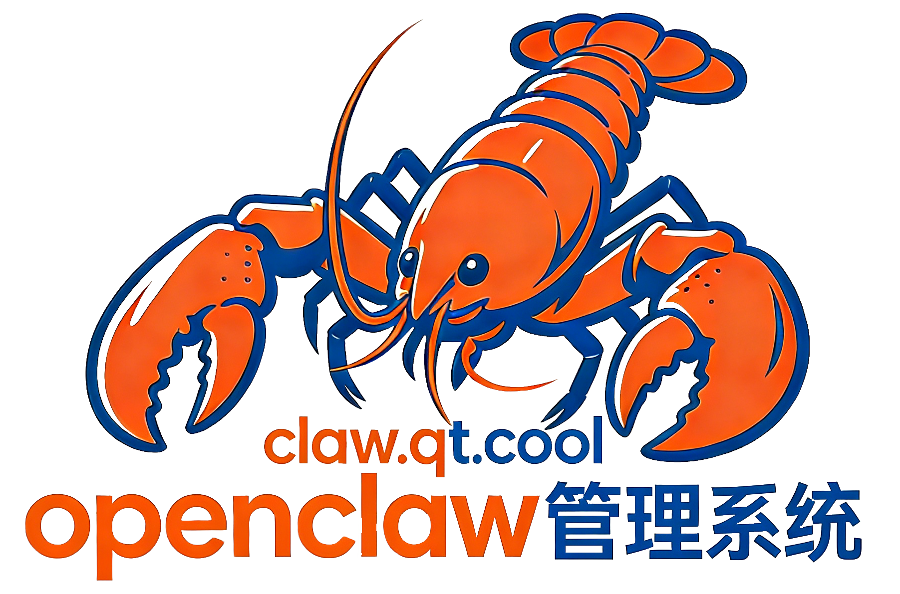
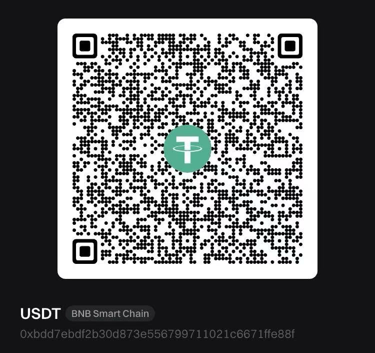

<p align="center">
  
</p>

<p align="center">
  Panneau de gestion OpenClaw avec Assistant IA intégré — Installation, Configuration, Diagnostic et Réparation en un clic
</p>

<p align="center">
  <a href="README.md">🇨🇳 中文</a> | <a href="README.en.md">🇺🇸 English</a> | <a href="README.zh-TW.md">🇹🇼 繁體中文</a> | <a href="README.ja.md">🇯🇵 日本語</a> | <a href="README.ko.md">🇰🇷 한국어</a> | <a href="README.vi.md">🇻🇳 Tiếng Việt</a> | <a href="README.es.md">🇪🇸 Español</a> | <a href="README.pt.md">🇧🇷 Português</a> | <a href="README.ru.md">🇷🇺 Русский</a> | <strong>🇫🇷 Français</strong> | <a href="README.de.md">🇩🇪 Deutsch</a>
</p>

<p align="center">
  <a href="https://github.com/TuLu-openclaw/tulu-openclaw-v2/releases/latest">
    
  </a>
  <a href="https://github.com/TuLu-openclaw/tulu-openclaw-v2/releases/latest">
    
  </a>
  <a href="https://github.com/TuLu-openclaw/tulu-openclaw-v2/blob/main/LICENSE">
    
  </a>
</p>

---

<p align="center">
  
</p>

星枢OpenClaw est un panneau de gestion visuel pour le framework d'agents IA [OpenClaw](https://github.com/openclaw/openclaw). Il intègre un **assistant IA intelligent** qui vous aide à installer OpenClaw en un clic, diagnostiquer automatiquement les configurations, résoudre les problèmes et corriger les erreurs. 8 outils + 4 modes + Q&A interactif — facile à gérer pour débutants et experts.

> 🌐 **Site web** : [GitHub Releases](https://github.com/TuLu-openclaw/tulu-openclaw-v2/releases/latest) | 📦 **Télécharger** : [GitHub Releases](https://github.com/TuLu-openclaw/tulu-openclaw-v2/releases/latest)

### 🔥 Support cartes de développement / Appareils embarqués

- **Orange Pi / Raspberry Pi / RK3588** — `npm run serve` pour exécuter
- **Armbian / Debian / Ubuntu Server** — Détection automatique d'architecture

## Communauté

Une communauté de développeurs et d'enthousiastes passionnés par les agents IA — rejoignez-nous !

<p align="center">
  <a href="https://discord.gg/U9AttmsNHh"><strong>Discord</strong></a>
  &nbsp;·&nbsp;
  <a href="https://github.com/TuLu-openclaw/tulu-openclaw-v2/discussions"><strong>Discussions</strong></a>
  &nbsp;·&nbsp;
  <a href="https://github.com/TuLu-openclaw/tulu-openclaw-v2/issues/new"><strong>Signaler un Issue</strong></a>
</p>

## Fonctionnalités

- **🤖 Assistant IA (Nouveau)** — Assistant IA intégré, 4 modes + 8 outils + Q&A interactif
- **🖼️ Reconnaissance d'images** — Collez des captures d'écran ou glissez des images, l'IA analyse automatiquement
- **Tableau de bord** — Vue d'ensemble du système, surveillance des services en temps réel
- **Gestion des services** — Démarrage/arrêt d'OpenClaw, détection de version et mise à jour en un clic
- **Configuration des modèles** — Gestion multi-fournisseurs, tests de connectivité par lots, tri par glisser-déposer
- **Configuration du Gateway** — Port, portée d'accès, Token d'authentification, Tailscale
- **Canaux de messagerie** — Gestion unifiée de Telegram, Discord, Feishu, DingTalk, QQ
- **Communication et automatisation** — Paramètres de messages, diffusion, Webhooks, approbation d'exécution
- **Analyse d'utilisation** — Utilisation des tokens, coûts API, classements modèles/fournisseurs
- **Gestion des Agents** — CRUD des Agents, édition d'identité, gestion du workspace
- **Chat** — Streaming, rendu Markdown, gestion des sessions
- **Tâches planifiées** — Exécution planifiée par Cron, livraison multicanal
- **Visionneuse de logs** — Logs en temps réel multi-sources et recherche par mots-clés
- **Gestion de la mémoire** — Voir/éditer les fichiers mémoire, export ZIP, changement d'Agent
- **Outils d'extension** — Gestion de tunnels cftunnel, surveillance ClawApp
- **À propos** — Informations de version, liens communautaires, projets associés

## Télécharger et installer

Rendez-vous sur [Releases](https://github.com/TuLu-openclaw/tulu-openclaw-v2/releases/latest) pour la dernière version :

| Plateforme | Installateur |
|-----------|-------------|
| **macOS Apple Silicon** | `.dmg` (aarch64) |
| **macOS Intel** | `.dmg` (x64) |

### Serveur Linux (Version Web)

```bash
curl -fsSL -o deploy.sh https://github.com/TuLu-openclaw/tulu-openclaw-v2/releases/latest/download/deploy.sh && bash deploy.sh
```

## Démarrage rapide

1. **Configuration initiale** — Le premier lancement détecte automatiquement Node.js, Git, OpenClaw. Installation en un clic si nécessaire
2. **Configurer les modèles** — Ajouter des fournisseurs d'IA (DeepSeek, OpenAI, Ollama, etc.) et tester la connectivité
3. **Démarrer le Gateway** — Aller dans Gestion des services, cliquer sur « Démarrer ». Statut vert = prêt
4. **Commencer à discuter** — Aller dans Chat en direct, sélectionner un modèle et commencer la conversation

## Architecture technique

| Couche | Technologie | Description |
|--------|-----------|-------------|
| Frontend | Vanilla JS + Vite | Sans framework, léger |
| Backend | Rust + Tauri v2 | Performance native, multiplateforme |
| Communication | Tauri IPC + Shell Plugin | Pont frontend-backend |
| Styles | Pure CSS (CSS Variables) | Thèmes sombre/clair |

## Compiler depuis les sources

```bash
git clone https://github.com/TuLu-openclaw/tulu-openclaw-v2.git
cd tulu-openclaw-v2 && npm install

# Bureau (nécessite Rust + Tauri v2)
npm run tauri dev        # Développement
npm run tauri build      # Production

# Web uniquement (sans Rust)
npm run dev              # Hot reload
npm run build && npm run serve  # Production
```

## Projets associés

| Projet | Description |
|--------|-------------|
| [OpenClaw](https://github.com/openclaw/openclaw) | Framework d'agents IA |
| [ClawApp](https://github.com/TuLu-openclaw/clawapp) | Client mobile multiplateforme |
| [cftunnel](https://github.com/TuLu-openclaw/cftunnel) | Outil Cloudflare Tunnel |

## Contribuer

Les Issues et Pull Requests sont les bienvenus. Voir [CONTRIBUTING.md](CONTRIBUTING.md).


## Sponsor

If you find this project useful, consider supporting us via USDT (BNB Smart Chain):



```
0xbdd7ebdf2b30d873e556799711021c6671ffe88f
```

## Contact

- **Email**: [support@qctx.net](mailto:support@qctx.net)
- **Product**: [GitHub Repository](https://github.com/TuLu-openclaw/tulu-openclaw-v2)

## Licence

[AGPL-3.0](LICENSE). Contactez-nous pour une licence commerciale.

© 2026 QingchenCloud | [GitHub Repository](https://github.com/TuLu-openclaw/tulu-openclaw-v2)
